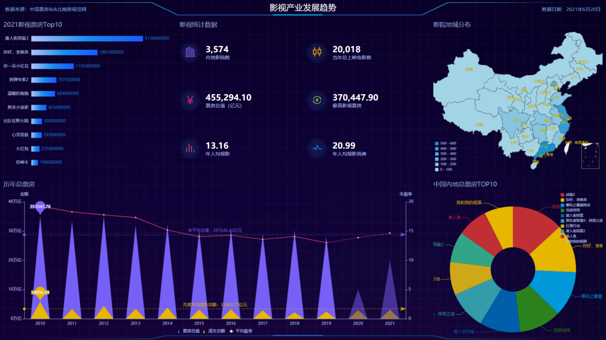
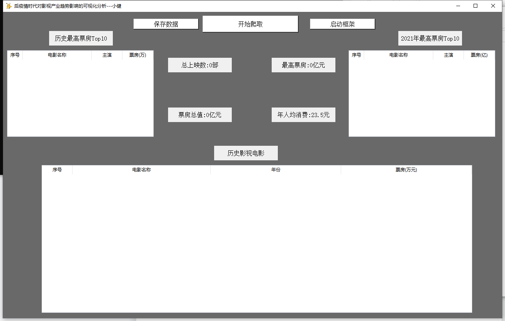

# 后疫情影视产业的趋势数据可视化


## 前言

​	本学期学习了数据可视化课程，临近期末开始做课设，就调研了数据，准备写一个——后疫情影视产业的趋势数据可视化的项目，也分析一下后疫情下影视产业的复习趋势，以此为题，做个记录

​	个人博客:www.chihongjian.cn 欢迎来踩踩

## 准备过程

### 调研数据

​	中国历年票房 ：http://www.boxofficecn.com/boxofficecn

​	电影年度排行Top10: https://baijiahao.baidu.com/s?id=1691816560197363894&wfr=spider&for=pc

​	影院数量: http://yte1.com/datas/cinema-nm?end=202

​	影院分布:https://wenku.baidu.com/view/674e9f4276a20029bc642d5a.html

### 技术栈

+ flask
+ Tkinter
+ Requests


## 效果图展示




## 实践

### 1.爬取各类数据

​	主要是爬取各类的数据结构集合，通过正则匹配分别匹配影视相关资料,展示一下2021年票房的代码片段

```python
#获取top10票房数据
def get_top10_boxOffice():
    url_top10 = "http://www.boxofficecn.com/the-red-box-office"
    html_top10 = requests.get(url_top10,headers=headers)

    re_top10 = r'<td class="column-2">(.*?（\d.\d）).*?</td><td class="column-3">(.*?)</td><td class="column-4">(.*?)</td>'
    data_re = re.findall(re_top10,html_top10.text)

    return data_re

#获取2021年票房
def get_2021_top10_boxOffice():
    url = "https://www.snhtdc.com.cn/articles/17176.html"

    html = requests.get(url,headers=headers)
    html.encoding = 'utf-8'

    r = '《(.*?)》(.*?)亿元'
    datas = list(re.findall(r,html.text))[1:]

    for item in range(len(datas)):
        datas[item] = list(datas[item])
        if(len(datas[item][0])>20):

            s = r".*?>(.*?)<.*?"
            temp = re.findall(s,datas[item][0])

            datas[item][0] = temp[0]

    return datas
```

### 2.Tk的使用

​	通过python内置的Tk桌面化使用库，我构建了一个关于桌面应用的.exe，让数据爬取可以非常便捷的完成，效果图与代码片段如下：

```python
import tkinter as tk

from tkinter import ttk
import random
import get_data
import threading
import tkinter.messagebox
import base64,os
import app

import pandas as pd


window = tk.Tk()

window.title('后疫情时代对影视产业趋势影响的可视化分析---小健')
window['background'] = "Dimgray"

window.geometry('1300x800+100+80')
```




## 使用文档与源代码

​	已全部开源至Github上，使用文档与操作说明皆有说明，请跳转至github下载查阅:


## 结尾

​	啊这，喵喵喵喵。嗷呜嗷呜嗷呜嗷呜。fun！
